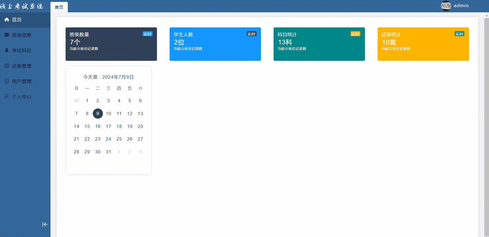
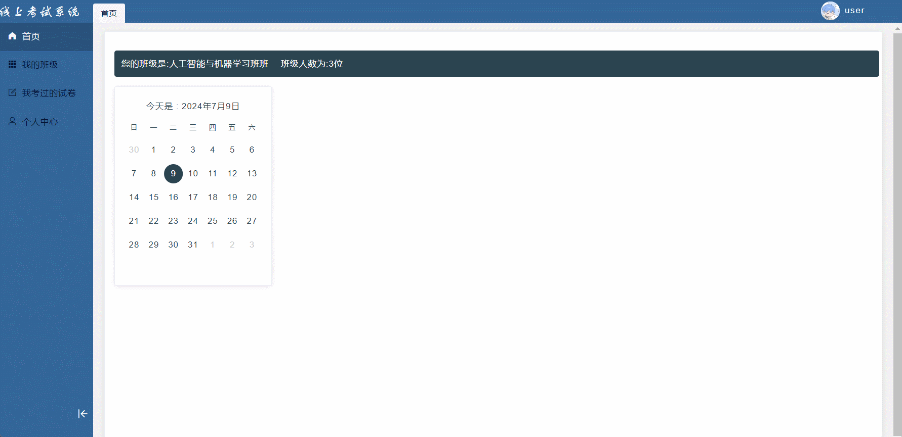

#  exam🎂

基于SpringBoot+Vue的在线考试系统

## 介绍🌞

> 基于SpringBoot+Vue的在线考试系统是一种结合了SpringBoot后端框架和Vue前端框架的在线考试平台。这种系统通过先进的Web技术，实现了从考试创建、题库管理、学生管理到成绩管理等核心功能的完整在线考试流程。

## 项目演示🌞

> 老师




> 学生



## 安装教程🌞

```
1. 运行环境准备mysql8 + java8 + node14.16.1

2. 配置maven路径，加载依赖

3. 运行sql文件，确保application.yml或config.properties的数据库名称和账号密码是数据库所在主机的账号密码
```


## 使用说明🌞

```
1. 登入

      管理员账号：admin 密码：123456
      
      学生账号：user 密码：123456
  
2. 运行流程

SpringBoot+Vue项目的部署详情可以查看这篇CSDN博客：http://t.csdnimg.cn/kpuxS

前后端不分离项目的部署流程可以查看这篇CSDN博客：http://t.csdnimg.cn/CslA5
```


## CSDN项目合集🌞

点击前往：http://t.csdnimg.cn/Q4u84


## 联系我🌞

**有偿获取完整源码或调试代码**

🐧：1902317191

微信：


